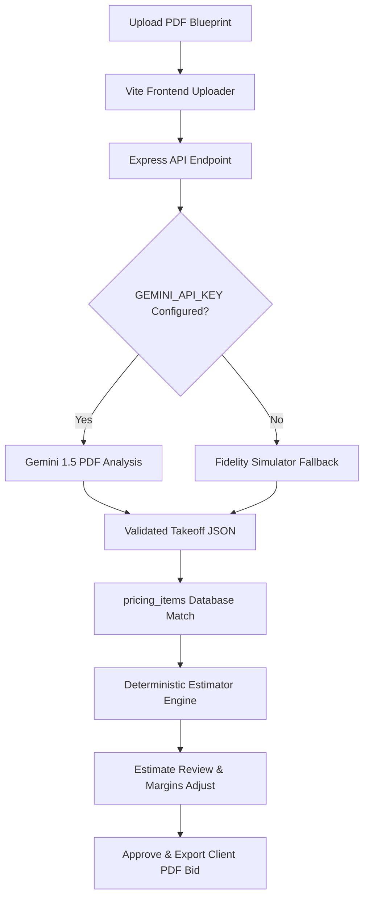

# BuildEstimate AI — Smart Estimating & Takeoff Platform

BuildEstimate AI is an AI-assisted construction estimating and quantity-takeoff platform designed initially for a residential/general contractor operating in **San Jose, California**.

The application streamlines drawing sheet analysis, extracts material dimensions, matches items with regional builder pricing databases, and outputs professional, print-ready client bids. It is built to keep the contractor in control, making it clear what quantities were AI-extracted versus contractor-modified, and tracking all overrides inside a permanent audit log.

---

## 🛠️ Technology Stack
- **Frontend**: React (Vite) + Lucide Icons + Custom CSS Design Tokens (Sleek light-mode with safety-orange accents).
- **Backend API**: Node.js + Express (Protected routes, deterministic estimating calculations, and base64 plan uploads).
- **Database**: Zero-dependency JSON Database (`server/db.json`) supporting relational lookups, transaction persistence, and change log history.
- **AI Plan Analysis**: Gemini API integration (`gemini-1.5-flash` for native multi-page PDF vision processing) with a high-fidelity local simulator fallback if no API key is provided.
- **PDF Generation**: `pdfkit` for server-side generation of high-quality, printable bid sheets.

---

## 🚀 Quick Start Guide

### Prerequisites
- Node.js (version 18.0.0 or higher)
- npm

### 1. Installation
Clone or download the project files into a folder, open your terminal at the root directory, and run:
```bash
npm run install:all
```
This script will concurrently install dependencies for the root, backend server, and Vite client application.

### 2. Environment Configuration
Create a `.env` file in the root directory by copying the template:
```bash
cp .env.example .env
```
Inside `.env`, configure your variables:
- `GEMINI_API_KEY`: Get this from [Google AI Studio](https://aistudio.google.com). *If left blank, the app will run in high-fidelity simulated takeoff mode automatically.*
- `PORT`: Server port (Defaults to `5000`).

### 3. Running Locally
Start both the Express API and the Vite React frontend concurrently by executing:
```bash
npm run dev
```
- **API Server** will start on [http://localhost:5000](http://localhost:5000)
- **Vite React UI** will start on [http://localhost:3000](http://localhost:3000)

### 4. Seed Account Credentials
For testing purposes, the database is auto-seeded with a default builder profile when the backend boots:
- **Email**: `contractor@sanjosebuild.com`
- **Password**: `admin123`

---

## 📐 AI Architecture & Workflow


### 1. Plan Upload & Analysis
Contractors upload a multi-sheet drawing PDF. The PDF is base64 encoded and sent to Gemini with custom prompts requiring structured JSON takeoff lists (materials, categories, quantity, unit, sheet reference, confidence).

### 2. Zero-Hallucination Guardrails
- If a quantity is unreadable, it is marked as **Needs Review** (represented in the UI as *Review Required* with warning alert tags).
- Prices are **never** invented by the AI. They must come from the contractor's catalog database. Missing price matches default to $0.00 and are flagged as *Pricing Missing* in red.

### 3. Estimating Pipeline
- **Direct Costs**: $\text{Quantity} \times \text{Unit Price}$
- **Waste Factor**: Applied only to Materials.
- **Project Markups**: Overhead, Contingency, and Profit percentages are applied to the adjusted direct costs in deterministic application code (decimal-safe currency calculations).
- **Recalculations**: Adjusting margin percentages in the UI instantly recalculates all totals.

---

## 📋 Folder Structures
```
├── package.json         # Concurrently script manager
├── .env.example         # Environment parameters template
├── .gitignore           # Ignored node_modules, local databases, upload caches
├── scripts/
│   └── test-estimating-engine.js  # Relational DB & mathematical engine checks
├── server/
│   ├── server.js        # Express API and routes definition
│   ├── database.js      # Relational file-based database manager
│   ├── ai-service.js    # Gemini API wrapper & plans takeoff simulator
│   ├── pricing-seed.js  # Starter catalog prices for San Jose
│   ├── pdf-generator.js # pdfkit drawing sheet bid exporter
│   └── uploads/         # Local drawing pdf storage cache (Git ignored)
└── client/
    ├── vite.config.js   # Client server & /api proxy routes
    ├── src/
    │   ├── main.jsx     # Vite client entry
    │   ├── index.css    # Premium CSS design tokens & grid layouts
    │   ├── App.jsx      # Global Router & auth state manager
    │   └── components/  # Dashboard, Takeoff split, Pricing tabs, Estimate calculators
```

---

## 🛡️ Contractor Traceability & Auditing
Every manual quantity override, margin adjustment, price change, and estimate approval generates an entry in the `audit_logs` database collection. This log displays contractor details, timestamps, action details, and oldValue/newValue diffs to assure bid credibility.

---

## 🌐 Netlify Deployment
To deploy this project to Netlify:
1. Build the Vite React application:
   ```bash
   cd client && npm run build
   ```
2. The compiled assets will be stored in `client/dist`.
3. Create serverless API routes using Netlify Functions mapping from the `server/` directory, or link the repository to host on Heroku, Render, or a VPS.
